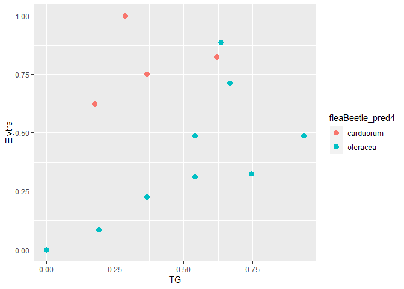

K-Nearest Neighbor
================
Erika Vargas
February 5, 2019

``` r
library(Flury) #contains the flea beetles dataset
library(tidyverse)
```

    ## -- Attaching packages -------------------------------------------- tidyverse 1.2.1 --

    ## v ggplot2 3.1.0     v purrr   0.2.5
    ## v tibble  1.4.2     v dplyr   0.7.8
    ## v tidyr   0.8.2     v stringr 1.4.0
    ## v readr   1.3.1     v forcats 0.3.0

    ## -- Conflicts ----------------------------------------------- tidyverse_conflicts() --
    ## x dplyr::filter() masks stats::filter()
    ## x dplyr::lag()    masks stats::lag()

``` r
library(dplyr)
library(ggplot2)
```

``` r
#Loading and exploring the data
data(flea.beetles)
head(flea.beetles)
```

    ##    Species  TG Elytra Second.Antenna Third.Antenna
    ## 1 oleracea 189    245            137           163
    ## 2 oleracea 192    260            132           217
    ## 3 oleracea 217    276            141           192
    ## 4 oleracea 221    299            142           213
    ## 5 oleracea 171    239            128           158
    ## 6 oleracea 192    262            147           173

``` r
str(flea.beetles)
```

    ## 'data.frame':    39 obs. of  5 variables:
    ##  $ Species       : Factor w/ 2 levels "oleracea","carduorum": 1 1 1 1 1 1 1 1 1 1 ...
    ##  $ TG            : int  189 192 217 221 171 192 213 192 170 201 ...
    ##  $ Elytra        : int  245 260 276 299 239 262 278 255 244 276 ...
    ##  $ Second.Antenna: int  137 132 141 142 128 147 136 128 128 146 ...
    ##  $ Third.Antenna : int  163 217 192 213 158 173 201 185 192 186 ...

``` r
dim(flea.beetles)
```

    ## [1] 39  5

``` r
table(flea.beetles$Species)
```

    ## 
    ##  oleracea carduorum 
    ##        19        20

``` r
names(flea.beetles)
```

    ## [1] "Species"        "TG"             "Elytra"         "Second.Antenna"
    ## [5] "Third.Antenna"

``` r
summary(flea.beetles)
```

    ##       Species         TG            Elytra      Second.Antenna 
    ##  oleracea :19   Min.   :158.0   Min.   :237.0   Min.   :121.0  
    ##  carduorum:20   1st Qu.:177.0   1st Qu.:262.5   1st Qu.:137.5  
    ##                 Median :184.0   Median :278.0   Median :146.0  
    ##                 Mean   :186.8   Mean   :279.2   Mean   :147.5  
    ##                 3rd Qu.:193.5   3rd Qu.:299.0   3rd Qu.:161.0  
    ##                 Max.   :221.0   Max.   :317.0   Max.   :184.0  
    ##  Third.Antenna  
    ##  Min.   :158.0  
    ##  1st Qu.:187.0  
    ##  Median :197.0  
    ##  Mean   :197.9  
    ##  3rd Qu.:213.0  
    ##  Max.   :235.0

*This data contains 39 observations of flea beetles; 19 from Haltica oleracea and 20 from Haltica carduourum (denoted by a factor) and four measurements. *

*Species:* a factor with levels oleracea carduorum

*TG:* Distance of the Transverse Groove to the posterior border of the prothorax (microns)

*Elytra:* Length of the Elytra (in units of 0.01mm)

*Second.Antenna:* Length of the second antennal joint (microns)

*Third.Antenna:* Length of the third antennal joint (microns)

``` r
# visualization
ggplot(data = flea.beetles) + geom_bar(mapping = aes(x=Species))
```


*There is only one more flea beetle in the sample dataset of the cardourum species. Hence, the proportion of H. oleracea flea beetles is 48.72% of the population, and the percentage of H. carduorum flea beetles is 51.28% of the population*

HISTOGRAMS
----------

``` r
#histogram for TG
flea.beetles%>%     ggplot(aes(x= TG, fill=Species))+     geom_histogram(binwidth = 10) 
```

 *The TG of the species have a what it seems a normal distribution. Oleracea beetles’ sample have a bigger distance of the Transverse Groove to the posterior border of the prothorax (microns) than the Carduorum beetles’ sample. The range of both species goes from approximately 150 to 230 Microns. The most frequent TG for oleracea and carduorum is 180 microns.*

``` r
#histogram for Elytra
flea.beetles%>%     ggplot(aes(x= Elytra, fill=Species))+     geom_histogram(binwidth = 10) 
```


*The Length of the Elytra (in units of 0.01mm) for oleracea beetles doesn’t seem to follow a normal distribution instead we can see a bimodal distribution. The range of both species goes from 235 to 325. The carduorum beetle’s distribution is left skewed. Usually Oleracea beetles have a bigger Elytra than Carduorum beetles. The most common Elytra for Oleracea is between 275 and 292mm. The most common Elytra measure for carduorum is between 295 and 310mm*

``` r
#histogram for Second.Antenna
flea.beetles%>%     ggplot(aes(x= Second.Antenna, fill=Species))+     geom_histogram(binwidth = 8) 
```


*For both species, the second antenna measure is skewed left. Meaning that the average length of the second antenna is less than the median length. The length range goes from 120 to 180 microns*

``` r
# histogram for Third.Antenna
flea.beetles%>%     ggplot(aes(x= Third.Antenna, fill=Species))+     geom_histogram(binwidth = 10)
```


*The oleracea third antenna length seems to be skewed right while the carduorum third antenna length is skewed left.*

DENSITY PLOTS
-------------

*The peaks of a Density Plot help display where values are concentrated over the interval. An advantage Density Plots have over Histograms is that they're better at determining the distribution shape because they're not affected by the number of bins used*

``` r
#Density plot of TG
flea.beetles%>%     ggplot(aes(x=TG, fill=Species))+     geom_density(alpha=0.5) 
```


``` r
#Density plot of Elytra
flea.beetles%>%     ggplot(aes(x=Elytra, fill=Species))+     geom_density(alpha=0.5)
```


``` r
#Density plot of Second.Antenna
flea.beetles%>%     ggplot(aes(x=Second.Antenna, fill=Species))+     geom_density(alpha=0.5) 
```


``` r
#Density plot of Third.Antenna
flea.beetles%>%     ggplot(aes(x=Third.Antenna, fill=Species))+     geom_density(alpha=0.5) 
```


SCATTER PLOTS with real data
----------------------------

``` r
flea.beetles%>%     ggplot(aes(x = TG, y = Elytra, colour = Species))+     geom_point(size = 3)
```


``` r
flea.beetles%>%     ggplot(aes(x = TG, y = Second.Antenna, colour = Species))+     geom_point(size = 3)
```


``` r
flea.beetles%>%     ggplot(aes(x = TG, y = Third.Antenna, colour = Species))+     geom_point(size = 3)
```


``` r
flea.beetles%>%     ggplot(aes(x = Elytra, y = Second.Antenna, colour = Species))+     geom_point(size = 3)
```


``` r
flea.beetles%>%     ggplot(aes(x = Elytra, y = Third.Antenna, colour = Species))+     geom_point(size = 3)
```


``` r
flea.beetles%>%     ggplot(aes(x = Second.Antenna, y = Third.Antenna, colour = Species))+     geom_point(size = 3)
```


KNN
===

### STEP 1 - normalizing numeric data

``` r
##the normalization function is created
nor <-function(x) {
  return ((x -min(x))/(max(x)-min(x)))   }

Flea_nor <- as.data.frame(lapply(flea.beetles[2:5], nor))

summary(Flea_nor)
```

    ##        TG             Elytra       Second.Antenna   Third.Antenna   
    ##  Min.   :0.0000   Min.   :0.0000   Min.   :0.0000   Min.   :0.0000  
    ##  1st Qu.:0.3016   1st Qu.:0.3187   1st Qu.:0.2619   1st Qu.:0.3766  
    ##  Median :0.4127   Median :0.5125   Median :0.3968   Median :0.5065  
    ##  Mean   :0.4575   Mean   :0.5279   Mean   :0.4212   Mean   :0.5181  
    ##  3rd Qu.:0.5635   3rd Qu.:0.7750   3rd Qu.:0.6349   3rd Qu.:0.7143  
    ##  Max.   :1.0000   Max.   :1.0000   Max.   :1.0000   Max.   :1.0000

### STEP 2 - creating training and test dataset. we are using same dataset

``` r
data <- which(1:length(Flea_nor[,1])%%3 == 0)
bee_train <- Flea_nor[-data,]
bee_test <- Flea_nor[data,]

#target value is species
bee_train_label <-as.matrix(flea.beetles[-data, 1])
bee_test_label <- as.matrix(flea.beetles[data, 1])
```

### STEP 3 - training model on data

``` r
library(class)
#k is generally chosen as the square root of the number of observations
sqrt(39)
```

    ## [1] 6.244998

``` r
fleaBeetle_pred5 <- knn(train = bee_train, test = bee_test, cl=bee_train_label,k=5)
```

### STEP 4 - evaluation of model performance

``` r
library(gmodels)
```

    ## Warning: package 'gmodels' was built under R version 3.5.2

``` r
CrossTable(x=bee_test_label, y= fleaBeetle_pred5,prop.chisq = FALSE)
```

    ## 
    ##  
    ##    Cell Contents
    ## |-------------------------|
    ## |                       N |
    ## |           N / Row Total |
    ## |           N / Col Total |
    ## |         N / Table Total |
    ## |-------------------------|
    ## 
    ##  
    ## Total Observations in Table:  13 
    ## 
    ##  
    ##                | fleaBeetle_pred5 
    ## bee_test_label | carduorum |  oleracea | Row Total | 
    ## ---------------|-----------|-----------|-----------|
    ##      carduorum |         5 |         2 |         7 | 
    ##                |     0.714 |     0.286 |     0.538 | 
    ##                |     1.000 |     0.250 |           | 
    ##                |     0.385 |     0.154 |           | 
    ## ---------------|-----------|-----------|-----------|
    ##       oleracea |         0 |         6 |         6 | 
    ##                |     0.000 |     1.000 |     0.462 | 
    ##                |     0.000 |     0.750 |           | 
    ##                |     0.000 |     0.462 |           | 
    ## ---------------|-----------|-----------|-----------|
    ##   Column Total |         5 |         8 |        13 | 
    ##                |     0.385 |     0.615 |           | 
    ## ---------------|-----------|-----------|-----------|
    ## 
    ## 

``` r
N <- nrow(Flea_nor)

accuracy_k5 = sum(fleaBeetle_pred5 == flea.beetles$Species)/N
round(accuracy_k5*100,2)  # % of accuracy
```

    ## [1] 61.54

*The test data considered 13 observations with k=5. Out of which 6 flea beetles have been accurately predicted as H.oleracea. 5 flea beetles were accurately predicted as H. carduorum. There were 2 flea beetles that were actually H.carduorum(2) but got predicted as H.oleracea (1).* *The total accuracy of the model is 61.54%*

**there may be chances to improve the model performance by incrementing or decreasing k.**

### STEP 5 - improve the performance of the model

``` r
#repeat step 3 and 4 with diff k 
#k = 4
fleaBeetle_pred4 <- knn(train = bee_train, test = bee_test, cl=bee_train_label,k=4)

CrossTable(x=bee_test_label, y= fleaBeetle_pred4,prop.chisq = FALSE)
```

    ## 
    ##  
    ##    Cell Contents
    ## |-------------------------|
    ## |                       N |
    ## |           N / Row Total |
    ## |           N / Col Total |
    ## |         N / Table Total |
    ## |-------------------------|
    ## 
    ##  
    ## Total Observations in Table:  13 
    ## 
    ##  
    ##                | fleaBeetle_pred4 
    ## bee_test_label | carduorum |  oleracea | Row Total | 
    ## ---------------|-----------|-----------|-----------|
    ##      carduorum |         6 |         1 |         7 | 
    ##                |     0.857 |     0.143 |     0.538 | 
    ##                |     1.000 |     0.143 |           | 
    ##                |     0.462 |     0.077 |           | 
    ## ---------------|-----------|-----------|-----------|
    ##       oleracea |         0 |         6 |         6 | 
    ##                |     0.000 |     1.000 |     0.462 | 
    ##                |     0.000 |     0.857 |           | 
    ##                |     0.000 |     0.462 |           | 
    ## ---------------|-----------|-----------|-----------|
    ##   Column Total |         6 |         7 |        13 | 
    ##                |     0.462 |     0.538 |           | 
    ## ---------------|-----------|-----------|-----------|
    ## 
    ## 

``` r
accuracy_k4 = sum(fleaBeetle_pred4 == flea.beetles$Species)/N
round(accuracy_k4*100,2)  # % of accuracy
```

    ## [1] 64.1

``` r
#k = 3
fleaBeetle_pred3 <- knn(train = bee_train, test = bee_test, cl=bee_train_label,k=3)

CrossTable(x=bee_test_label, y= fleaBeetle_pred3,prop.chisq = FALSE)
```

    ## 
    ##  
    ##    Cell Contents
    ## |-------------------------|
    ## |                       N |
    ## |           N / Row Total |
    ## |           N / Col Total |
    ## |         N / Table Total |
    ## |-------------------------|
    ## 
    ##  
    ## Total Observations in Table:  13 
    ## 
    ##  
    ##                | fleaBeetle_pred3 
    ## bee_test_label | carduorum |  oleracea | Row Total | 
    ## ---------------|-----------|-----------|-----------|
    ##      carduorum |         4 |         3 |         7 | 
    ##                |     0.571 |     0.429 |     0.538 | 
    ##                |     0.800 |     0.375 |           | 
    ##                |     0.308 |     0.231 |           | 
    ## ---------------|-----------|-----------|-----------|
    ##       oleracea |         1 |         5 |         6 | 
    ##                |     0.167 |     0.833 |     0.462 | 
    ##                |     0.200 |     0.625 |           | 
    ##                |     0.077 |     0.385 |           | 
    ## ---------------|-----------|-----------|-----------|
    ##   Column Total |         5 |         8 |        13 | 
    ##                |     0.385 |     0.615 |           | 
    ## ---------------|-----------|-----------|-----------|
    ## 
    ## 

``` r
accuracy_k3 = sum(fleaBeetle_pred3 == flea.beetles$Species)/N
round(accuracy_k3*100,2)  #% of accuracy
```

    ## [1] 56.41

*The test data considered 13 observations with k=3. Out of which 5 flea beetles have been accurately predicted as H.oleracea. 4 out 13 flea beetles were accurately predicted as H. carduorum. There were 4 flea beetles missclassified.* *The total accuracy of the model is 56.41%*

``` r
#k = 1
fleaBeetle_pred1 <- knn(train = bee_train, test = bee_test, cl=bee_train_label,k=1)

CrossTable(x=bee_test_label, y= fleaBeetle_pred1,prop.chisq = FALSE)
```

    ## 
    ##  
    ##    Cell Contents
    ## |-------------------------|
    ## |                       N |
    ## |           N / Row Total |
    ## |           N / Col Total |
    ## |         N / Table Total |
    ## |-------------------------|
    ## 
    ##  
    ## Total Observations in Table:  13 
    ## 
    ##  
    ##                | fleaBeetle_pred1 
    ## bee_test_label | carduorum |  oleracea | Row Total | 
    ## ---------------|-----------|-----------|-----------|
    ##      carduorum |         6 |         1 |         7 | 
    ##                |     0.857 |     0.143 |     0.538 | 
    ##                |     0.857 |     0.167 |           | 
    ##                |     0.462 |     0.077 |           | 
    ## ---------------|-----------|-----------|-----------|
    ##       oleracea |         1 |         5 |         6 | 
    ##                |     0.167 |     0.833 |     0.462 | 
    ##                |     0.143 |     0.833 |           | 
    ##                |     0.077 |     0.385 |           | 
    ## ---------------|-----------|-----------|-----------|
    ##   Column Total |         7 |         6 |        13 | 
    ##                |     0.538 |     0.462 |           | 
    ## ---------------|-----------|-----------|-----------|
    ## 
    ## 

``` r
accuracy_k1 = sum(fleaBeetle_pred1 == flea.beetles$Species)/N
round(accuracy_k1*100,2)   # % of accuracy
```

    ## [1] 61.54

*Based on this plot , K=5,4,and 1 yield the smallest test error rate.* *taking into account that the dataset is not big enough.I choose K=4 as the best number of neighbors for KNN in the prediction.* *The total accuracy of the model is 97.43%, making it the best model.* *The classification result based on K=4 is shown in the following the scatter plot.*

``` r
#scatter plot flea beetle prediction 
fleaBeetle_pred4 <- knn(train = bee_train, test = bee_test, cl=bee_train_label,k=4)
result <-cbind(bee_test,fleaBeetle_pred4)
combinetest <- cbind(bee_test, bee_test_label)

result%>%
  ggplot(aes(x=TG, y= Elytra, color= fleaBeetle_pred4))+geom_point(size=3)
```


